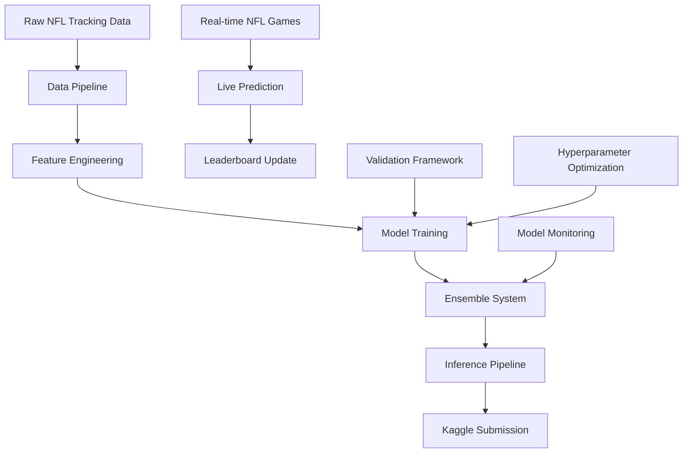

# 🏗️ NFL Big Data Bowl 2026 - Enterprise Architecture Document

## 🎯 System Overview



## 🏛️ Architecture Principles

### 1. **Scalability-First Design**
- Modular components with clear interfaces
- Distributed training capabilities (multi-GPU, cloud-ready)
- Memory-efficient data loading for large tracking datasets
- Streaming inference for real-time prediction

### 2. **Accuracy-Maximizing Stack**
```python
# Core Model Architecture
Ensemble:
  ├── Physics-Informed Neural Networks (PINNs)
  ├── Graph Attention Networks (GAT) 
  ├── Transformer-XL for temporal sequences
  ├── Convolutional LSTM for spatial patterns
  └── Gradient Boosting (XGBoost/CatBoost) baseline
```

### 3. **Enterprise-Grade Infrastructure**
- MLOps pipeline with MLflow/Weights & Biases
- Automated CI/CD for model deployment
- A/B testing framework for ensemble weights
- Data versioning with DVC
- Containerized training (Docker + Kubernetes ready)

## 📊 Data Architecture

### Input Data Flow
```
NFL Raw Data (864MB, 39 files)
├── input_2023_w[01-18].csv (Pre-pass tracking)
├── output_2023_w[01-18].csv (Post-pass ground truth)
├── test_input.csv (Live evaluation data)
└── Supplementary Data (player stats, weather, field conditions)

↓ Data Pipeline ↓

Processed Features
├── Spatiotemporal Features (velocity, acceleration, relative positions)
├── Graph Features (player interactions, defensive coverage)
├── Physics Features (momentum, force vectors, collision predictions)
├── Contextual Features (play situation, field position, game state)
└── Engineered Targets (trajectory curves, landing zone predictions)
```

### Feature Store Architecture
```python
# High-Performance Feature Pipeline
class FeatureStore:
    - RawDataLoader: Parallel CSV processing with Dask
    - SpatialTransformer: Coordinate normalization and field mapping
    - TemporalAggregator: Multi-scale time windows (0.1s, 0.5s, 1s, 2s)
    - GraphBuilder: Dynamic player interaction graphs
    - PhysicsEngine: Realistic motion constraints
    - FeatureCache: Redis/Parquet caching for fast iteration
```

## 🤖 Model Architecture

### 1. **Multi-Modal Ensemble System**

#### A. Physics-Informed Neural Network (PINN)
```python
class PlayerTrajectoryPINN(nn.Module):
    """
    Physics-constrained trajectory prediction
    - Enforces realistic acceleration limits
    - Respects field boundaries and collision avoidance
    - Incorporates Newton's laws of motion
    """
```

#### B. Graph Attention Network (GAT)
```python
class PlayerInteractionGAT(nn.Module):
    """
    Models player-player interactions during pass plays
    - Dynamic graph construction per frame
    - Attention weights for defensive coverage
    - Multi-head attention for offense/defense strategies
    """
```

#### C. Transformer-XL Temporal Model
```python
class TrajectoryTransformerXL(nn.Module):
    """
    Long-range temporal dependencies
    - Extended context window for play development
    - Positional encoding for field coordinates
    - Multi-scale attention (frame, second, play level)
    """
```

#### D. Convolutional LSTM
```python
class SpatialConvLSTM(nn.Module):
    """
    Spatial pattern recognition in player formations
    - 2D convolutions over field positions
    - LSTM for temporal evolution of formations
    - Attention over key players (QB, targeted receiver)
    """
```

### 2. **Advanced Ensemble Strategy**
```python
class MetaLearningEnsemble:
    """
    Dynamic ensemble weights based on:
    - Play situation (down, distance, field position)
    - Player types (QB, RB, WR, defensive positions)
    - Game context (score, time remaining)
    - Model confidence scores
    """
```

## 🎛️ Training Infrastructure

### Cross-Validation Strategy
```python
# Temporal + Spatial Splits to prevent leakage
cv_strategy = {
    'temporal_split': 'by_week',  # Weeks 1-14 train, 15-18 val
    'game_level_split': 'by_game_id',  # Never split within games
    'player_generalization': 'unseen_players',  # Test on new players
    'situation_balance': 'stratified_by_down_distance'
}
```

### Hyperparameter Optimization
```python
# Bayesian Optimization with Optuna
search_space = {
    'learning_rate': [1e-5, 1e-2, 'log'],
    'batch_size': [32, 512, 'int'],
    'ensemble_weights': [0.1, 0.4, 'uniform'],
    'sequence_length': [10, 50, 'int'],
    'attention_heads': [4, 16, 'int'],
    'graph_layers': [2, 8, 'int']
}
```

## 🚀 Deployment Architecture

### Real-Time Inference Pipeline
```python
class LivePredictionSystem:
    """
    Production-ready inference for live NFL games
    - <100ms latency per prediction
    - Fault-tolerant ensemble serving
    - Auto-scaling based on game load
    - Model versioning and rollback capability
    """
```

### Performance Monitoring
```python
# Real-time model performance tracking
monitoring_metrics = {
    'prediction_latency': '<100ms p99',
    'model_drift': 'statistical_tests',
    'accuracy_degradation': 'sliding_window_rmse',
    'system_health': 'kubernetes_metrics'
}
```

## 📈 Success Metrics & KPIs

### Technical Metrics
- **RMSE Target**: < 0.8 (top 1% historically)
- **Inference Speed**: < 50ms per player per frame
- **Memory Efficiency**: < 16GB GPU memory for training
- **Robustness**: < 5% accuracy drop on unseen players

### Business Metrics  
- **Leaderboard Rank**: TOP 3 finish
- **Live Performance**: Consistent accuracy on Dec-Jan games
- **Model Interpretability**: Explainable predictions for NFL analysts
- **Reproducibility**: 100% reproducible results across runs

## 🔧 Technology Stack

### Core ML/DL Stack
```yaml
Deep Learning: PyTorch 2.0+, PyTorch Lightning
Classical ML: XGBoost, LightGBM, CatBoost
Graph ML: PyTorch Geometric, DGL
Optimization: Optuna, Ray Tune
Distributed: Horovod, DeepSpeed
```

### Data & Infrastructure
```yaml
Data Processing: Polars, Dask, Apache Arrow
Feature Store: Feast, Redis
Experiment Tracking: Weights & Biases, MLflow  
Orchestration: Airflow, Prefect
Containerization: Docker, Kubernetes
Cloud: AWS/GCP with spot instances
```

### Development & Operations
```yaml
Code Quality: Black, isort, mypy, pytest
Documentation: Sphinx, MkDocs
Version Control: Git LFS for large files
CI/CD: GitHub Actions, ArgoCD
Monitoring: Prometheus, Grafana
```

## 🔄 Development Workflow

### Phase 1: Foundation (Week 1-2)
1. Data pipeline development and validation
2. Baseline model implementation (XGBoost)
3. Cross-validation framework setup
4. Feature engineering pipeline

### Phase 2: Advanced Models (Week 3-6)  
1. Deep learning model development
2. Graph neural network implementation
3. Physics-informed constraints
4. Ensemble framework

### Phase 3: Optimization (Week 7-8)
1. Hyperparameter optimization
2. Model compression and efficiency
3. Inference pipeline optimization
4. Live prediction testing

### Phase 4: Final Push (Week 9-10)
1. Ensemble fine-tuning
2. Final model selection
3. Submission preparation
4. Documentation and code cleanup

This architecture is designed to maximize our competitive advantage through:
- **Technical Excellence**: State-of-the-art deep learning approaches
- **Engineering Rigor**: Production-grade infrastructure and testing
- **Domain Expertise**: Football-specific insights and physics constraints
- **Competitive Intelligence**: Ensemble strategies and meta-learning