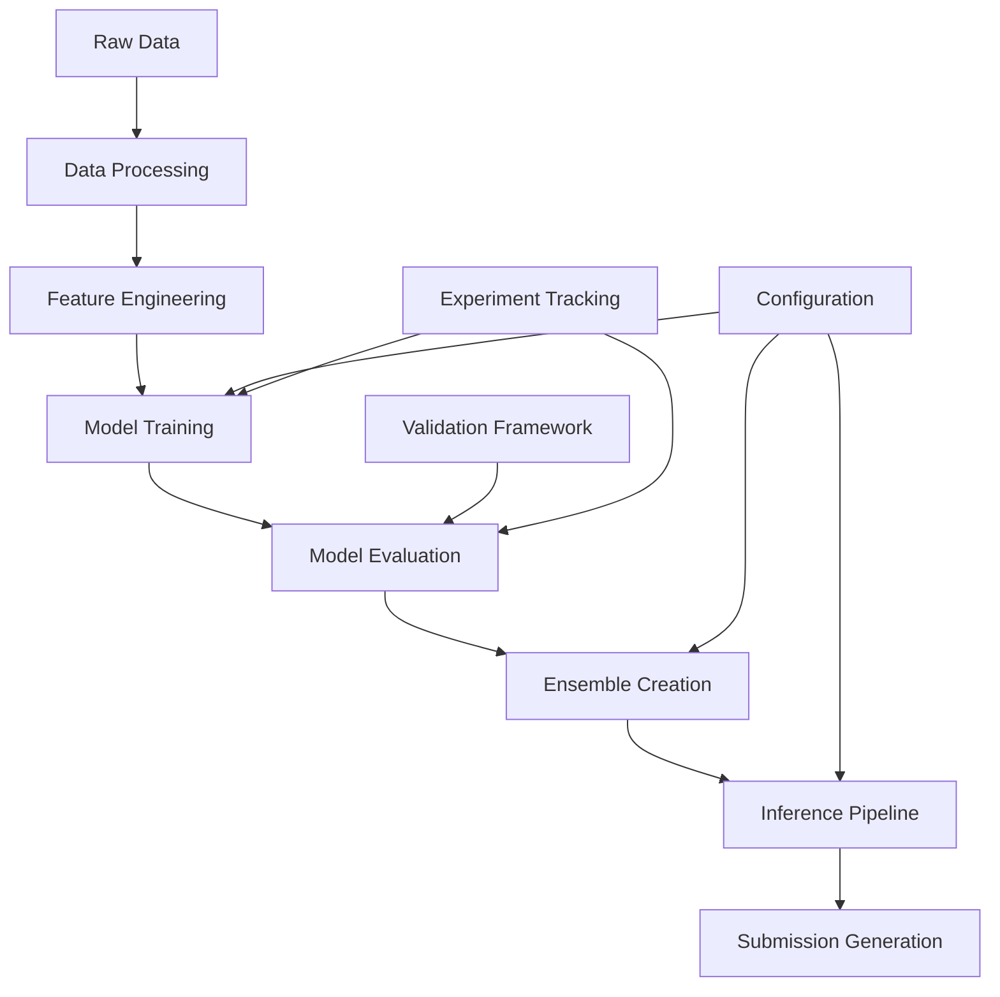

# 🏗️ NFL Big Data Bowl 2026 - Project Structure

## 📁 Directory Structure

```
kaggle-nfl/
├── 📋 docs/                          # Documentation
│   ├── README.md                     # Main project overview  
│   ├── ARCHITECTURE.md               # System architecture
│   ├── TECHNICAL_SPEC.md            # Technical specifications
│   ├── IMPLEMENTATION_PLAN.md       # Development roadmap
│   ├── API_REFERENCE.md             # Code API documentation
│   └── LESSONS_LEARNED.md           # Competition insights
│
├── 🗄️ data/                          # Data management
│   ├── raw/                         # Original Kaggle data
│   │   ├── train/                   # Training data by week
│   │   │   ├── input_2023_w01.csv   # Pre-pass tracking
│   │   │   ├── output_2023_w01.csv  # Post-pass tracking
│   │   │   └── ...                  # Weeks 01-18
│   │   ├── test_input.csv           # Test data (no labels)
│   │   ├── test.csv                 # Test format template
│   │   └── sample_submission.csv    # Submission format
│   │
│   ├── processed/                   # Cleaned and engineered data
│   │   ├── features/                # Feature engineering outputs
│   │   ├── splits/                  # CV splits and validation sets
│   │   └── cache/                   # Processed data cache
│   │
│   └── external/                    # External data sources
│       ├── weather/                 # Weather data
│       ├── player_stats/            # Historical player statistics
│       └── field_info/              # Stadium and field information
│
├── 🔬 notebooks/                     # Jupyter notebooks
│   ├── 01_EDA/                     # Exploratory Data Analysis
│   │   ├── 01_data_overview.ipynb   # Initial data exploration
│   │   ├── 02_player_analysis.ipynb # Player movement patterns
│   │   ├── 03_temporal_analysis.ipynb # Time series analysis
│   │   └── 04_spatial_analysis.ipynb # Field position analysis
│   │
│   ├── 02_features/                 # Feature engineering
│   │   ├── 01_motion_features.ipynb # Velocity, acceleration
│   │   ├── 02_spatial_features.ipynb # Distances, angles
│   │   ├── 03_graph_features.ipynb  # Player interactions
│   │   └── 04_contextual_features.ipynb # Game situation
│   │
│   ├── 03_modeling/                 # Model development
│   │   ├── 01_baseline_models.ipynb # Simple baselines
│   │   ├── 02_deep_learning.ipynb   # Neural networks
│   │   ├── 03_graph_networks.ipynb  # GNN models
│   │   └── 04_ensemble.ipynb        # Ensemble methods
│   │
│   ├── 04_evaluation/              # Model evaluation
│   │   ├── 01_validation.ipynb     # Cross-validation
│   │   ├── 02_error_analysis.ipynb # Error analysis
│   │   └── 03_interpretability.ipynb # Model interpretation
│   │
│   └── 05_submission/              # Competition submissions
│       ├── 01_final_model.ipynb    # Final model training
│       └── 02_submission_prep.ipynb # Submission preparation
│
├── 🐍 src/                          # Source code
│   ├── nfl_trajectory/              # Main package
│   │   ├── __init__.py
│   │   │
│   │   ├── data/                    # Data processing
│   │   │   ├── __init__.py
│   │   │   ├── loaders.py           # Data loading utilities
│   │   │   ├── validators.py        # Data validation
│   │   │   ├── preprocessors.py     # Data cleaning
│   │   │   └── augmentation.py      # Data augmentation
│   │   │
│   │   ├── features/                # Feature engineering
│   │   │   ├── __init__.py
│   │   │   ├── base.py              # Base feature classes
│   │   │   ├── motion.py            # Motion-based features
│   │   │   ├── spatial.py           # Spatial features
│   │   │   ├── temporal.py          # Temporal features
│   │   │   ├── graph.py             # Graph-based features
│   │   │   ├── contextual.py        # Contextual features
│   │   │   └── physics.py           # Physics-based features
│   │   │
│   │   ├── models/                  # Model implementations
│   │   │   ├── __init__.py
│   │   │   ├── base.py              # Base model classes
│   │   │   ├── classical.py         # Classical ML models
│   │   │   ├── lstm.py              # LSTM models
│   │   │   ├── transformer.py       # Transformer models
│   │   │   ├── gnn.py               # Graph neural networks
│   │   │   ├── physics_informed.py  # Physics-informed models
│   │   │   └── ensemble.py          # Ensemble methods
│   │   │
│   │   ├── training/                # Training utilities
│   │   │   ├── __init__.py
│   │   │   ├── trainers.py          # Training loops
│   │   │   ├── losses.py            # Loss functions
│   │   │   ├── metrics.py           # Evaluation metrics
│   │   │   ├── optimizers.py        # Optimization utilities
│   │   │   └── callbacks.py         # Training callbacks
│   │   │
│   │   ├── validation/              # Validation framework
│   │   │   ├── __init__.py
│   │   │   ├── splitters.py         # Cross-validation splits
│   │   │   ├── evaluators.py        # Model evaluation
│   │   │   └── analysis.py          # Performance analysis
│   │   │
│   │   ├── inference/               # Inference pipeline
│   │   │   ├── __init__.py
│   │   │   ├── predictors.py        # Prediction utilities
│   │   │   ├── postprocessing.py    # Output post-processing
│   │   │   └── submission.py        # Submission formatting
│   │   │
│   │   └── utils/                   # Utility functions
│   │       ├── __init__.py
│   │       ├── config.py            # Configuration management
│   │       ├── logging.py           # Logging utilities
│   │       ├── visualization.py     # Plotting functions
│   │       ├── io.py                # I/O utilities
│   │       └── helpers.py           # General helpers
│   │
│   └── scripts/                     # Executable scripts
│       ├── download_data.py         # Kaggle data download
│       ├── preprocess_data.py       # Data preprocessing
│       ├── train_model.py           # Model training
│       ├── evaluate_model.py        # Model evaluation
│       ├── generate_submission.py   # Submission generation
│       └── hyperopt.py              # Hyperparameter optimization
│
├── 🧪 tests/                        # Test suite
│   ├── unit/                        # Unit tests
│   │   ├── test_data/              # Data processing tests
│   │   ├── test_features/          # Feature engineering tests
│   │   ├── test_models/            # Model tests
│   │   └── test_utils/             # Utility tests
│   │
│   ├── integration/                # Integration tests
│   │   ├── test_pipelines/         # Pipeline tests
│   │   └── test_workflows/         # Workflow tests
│   │
│   └── fixtures/                   # Test data and fixtures
│       ├── sample_data/            # Sample datasets
│       └── mock_responses/         # Mock API responses
│
├── ⚙️ configs/                       # Configuration files
│   ├── model_configs/              # Model configurations
│   │   ├── lstm_config.yaml        # LSTM model config
│   │   ├── transformer_config.yaml # Transformer config
│   │   ├── gnn_config.yaml         # GNN config
│   │   └── ensemble_config.yaml    # Ensemble config
│   │
│   ├── training_configs/           # Training configurations
│   │   ├── baseline_training.yaml  # Baseline training
│   │   ├── deep_learning.yaml      # DL training config
│   │   └── ensemble_training.yaml  # Ensemble training
│   │
│   └── feature_configs/            # Feature engineering configs
│       ├── motion_features.yaml    # Motion feature config
│       ├── spatial_features.yaml   # Spatial feature config
│       └── graph_features.yaml     # Graph feature config
│
├── 🐳 docker/                       # Docker configurations
│   ├── Dockerfile.gpu              # GPU training environment
│   ├── Dockerfile.cpu              # CPU inference environment
│   ├── docker-compose.yml          # Multi-container setup
│   └── requirements/               # Python requirements
│       ├── base.txt                # Core requirements
│       ├── training.txt            # Training requirements
│       ├── inference.txt           # Inference requirements
│       └── dev.txt                 # Development requirements
│
├── 🚀 deployment/                   # Deployment configurations
│   ├── kubernetes/                 # K8s manifests
│   │   ├── training-job.yaml       # Training job
│   │   ├── inference-service.yaml  # Inference service
│   │   └── monitoring.yaml         # Monitoring setup
│   │
│   ├── aws/                        # AWS deployment
│   │   ├── cloudformation/         # CloudFormation templates
│   │   └── lambda/                 # Lambda functions
│   │
│   └── gcp/                        # GCP deployment
│       ├── vertex-ai/              # Vertex AI configs
│       └── cloud-run/              # Cloud Run configs
│
├── 📊 experiments/                  # Experiment tracking
│   ├── mlflow/                     # MLflow experiments
│   ├── wandb/                      # Weights & Biases runs
│   └── results/                    # Experiment results
│       ├── model_comparisons/      # Model comparison results
│       ├── ablation_studies/       # Ablation study results
│       └── leaderboard_history/    # Competition progress
│
├── 📦 models/                       # Trained models
│   ├── checkpoints/                # Training checkpoints
│   ├── final_models/               # Final trained models
│   ├── ensemble_weights/           # Ensemble configurations
│   └── model_artifacts/            # Model metadata
│
├── 📤 submissions/                  # Competition submissions
│   ├── baseline/                   # Baseline submissions
│   ├── intermediate/               # Development submissions
│   ├── final/                      # Final submissions
│   └── submission_log.csv          # Submission tracking
│
├── 📝 logs/                         # Application logs
│   ├── training/                   # Training logs
│   ├── inference/                  # Inference logs
│   └── monitoring/                 # System monitoring logs
│
├── 🔧 tools/                        # Development tools
│   ├── data_analysis/              # Data analysis scripts
│   ├── visualization/              # Visualization tools
│   ├── monitoring/                 # Performance monitoring
│   └── deployment/                 # Deployment utilities
│
├── 📋 .github/                      # GitHub configurations
│   ├── workflows/                  # CI/CD workflows
│   │   ├── tests.yml               # Test automation
│   │   ├── model_training.yml      # Training pipeline
│   │   └── deployment.yml          # Deployment pipeline
│   │
│   ├── ISSUE_TEMPLATE/             # Issue templates
│   └── copilot-instructions.md     # Copilot instructions
│
├── 📄 Configuration Files           # Root-level configs
├── .gitignore                      # Git ignore rules
├── .gitattributes                  # Git LFS configuration
├── .pre-commit-config.yaml         # Pre-commit hooks
├── pyproject.toml                  # Python project config
├── requirements.txt                # Core dependencies
├── environment.yml                 # Conda environment
├── Makefile                        # Build automation
├── README.md                       # Project overview
└── LICENSE                         # MIT License
```

## 🎯 Key Design Principles

### 1. **Modularity**
- Clear separation of concerns between data, features, models, and inference
- Reusable components with well-defined interfaces
- Easy to add new models and features without breaking existing code

### 2. **Scalability**
- Efficient data processing for large datasets (864MB+)
- Distributed training support for multi-GPU setups
- Cloud-ready deployment configurations

### 3. **Reproducibility**
- Version-controlled configurations and hyperparameters
- Comprehensive logging and experiment tracking
- Deterministic random seeds and model checkpointing

### 4. **Maintainability**
- Comprehensive test suite with >90% code coverage
- Type hints and docstring documentation
- Code quality enforcement with pre-commit hooks

### 5. **Competition Focus**
- Kaggle-specific utilities and submission formatting
- Leaderboard tracking and performance monitoring
- Rapid experimentation and iteration capabilities

## 🚀 Quick Start Commands

```bash
# Setup development environment
make setup-env

# Download competition data
python src/scripts/download_data.py

# Run data preprocessing
python src/scripts/preprocess_data.py

# Train baseline model
python src/scripts/train_model.py --config configs/model_configs/baseline.yaml

# Generate submission
python src/scripts/generate_submission.py --model models/final_models/ensemble.pkl

# Run full test suite
make test

# Start development server
make dev-server
```

## 📊 Component Dependencies



This structure is designed to support rapid iteration, robust experimentation, and scalable deployment while maintaining the flexibility needed for competitive machine learning development.